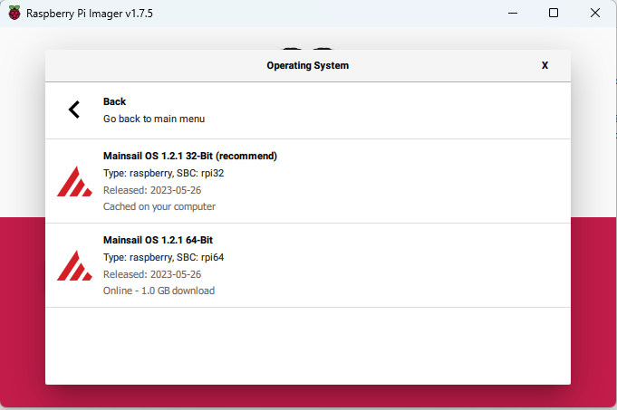
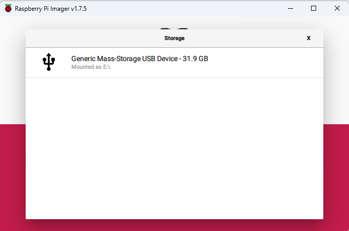
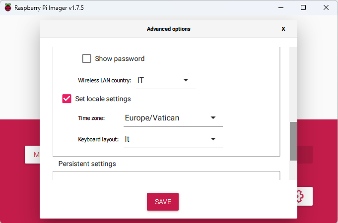
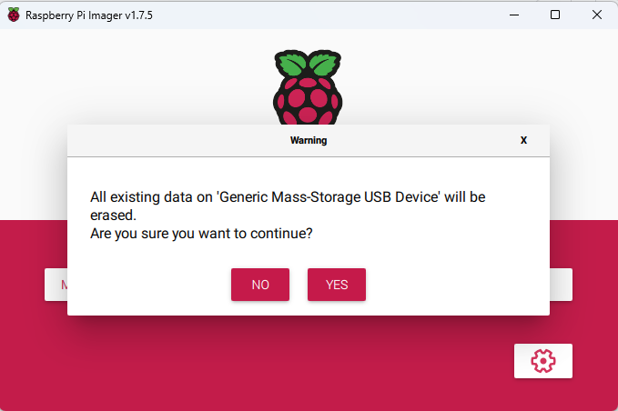

# Parts needed
- Raspberry Pi 3b or heigher
- Minimum of 16GB micro SD card (minimum size can be 4Gb, 16 - 64Gb is recommended as you will later store print files on this card. Never cheap out on build parts, that includes quality SD card as well)
# Overview
Raspberry Pi Imager is the quick and easy way to install MainsailOS and other operating systems to a microSD card, ready to use with your Raspberry Pi. 
Download and install Raspberry Pi Imager to a computer with an SD card reader. 
Put the SD card you'll use with your Raspberry Pi into the reader and run Raspberry Pi Imager.

If you don't have "Raspberry Pi Imager" installed on your computer, then it's time to do it now!
You can download it here: <a href="https://www.raspberrypi.com/software/">Raspberry Pi Imager</a>

What is MainsailOS?
MainsailOS is a prebuilt image for several Single Board Computers (SBC) models. It contains some pre-configuration and software needed to run with  firmware and 
as your WebGUI to control your 3D printer.
MainsailOS images includes:

- Mainsail
- Klipper
- Moonraker
- Crowsnest as webcam daemon​
- Sonar as keep alive daemon
- Timelapse plugin for Moonraker
- Preinstalled software dependencies:
  - Measuring Resonances
  - Katapult (Former CanBoot)
  - KlipperScreen

​MainsailOS is not the "all in one" solution for any use case. It is just a simple and easy starting point to enjoy Mainsail and its features.

# Setup
1. Start "Raspberry Pi Imager" and press "CHOOSE OS"
   
   
   
2. Scroll down and pick "Other Specific-Purpose OS"
   
   
   
3. Here you choose option "3D Printing"
   
   
   
4. Now you have to decide operatingsystem and we pick "Mainsail OS"
   
   
   
5. Recomended installation is "32-bit" so we pick that and move on
   
   
   
6. Next step is to choose storage
   
   

7. When you press "Choose Storage" yor promt to pick the SD card you have put into your reader. In this sample we pick "Generic Mass-Storage USB Device - 31.9 GB" and is mounted as E:\
   If you have more Cardreader conected to your computer be sure to pick correct SD card and move on!

   

8. Before we we write image to the SD card we need to add hostname, Enable SSH, WIFI etc. so by pressing the wheel in the bottom right corner we marked with a green circle you enter advanced options for your MainsailOS installation.

   (It's possible to skip this but if you are not an advanced user we recomend to follow this guide.)

   

9. Advanced options let you set some important parameters directly without to be needed to do it with SSH later when you startup your Rasperry Pi with MainsailOP for the first time. With this done you have a out of the box installation ready directly when you power up your Raspberry Pi for the first time.

- Set hostname: Raspberry
  - This is where you name your hostname that will be used as Raspberry.local when you connect to your MainsailOS installation. It's also possible to use IP number of your Raspberry if your computer dont support .local on your LAN.
- Enable SSH: Use password authentication
  - Somehow you need to connect to your Raspberry and with Putty you can communicate with SSH and manage your installation when needed. By enable SSH you can do all of this whenevery you would need it.

   

- Set username and password: Username and password
  - You need a username and password to use SSH and for your security. Don't forget your password because you have to reinstall everything if you forgot it and need to use SSH.
- Configure wireless LAN:
  - If you are going to use WIFI to connect to your LAN, then you need to fill in SSID and password. Just ignor this part if you dont have WIFI and connect your raspberry with a cable to your LAN.

  

- Wireless LAN country:
  - If you use wireless connection you set what country it's located in.
- Set local settings:
  - Chooce local time zone you like to use and keyboard layout.

  

- Persistent settings:
  - "Play sound when finish" let you know when your SD card is ready to be removed.
  - "Eject media when finish" make it safe to remove SD card withour risking to damage it.

Click, "Save" when you are ready for next step. All settings are stored for this session and until you close down Raspberry Pi imager.

    

10. .........

    

11. .........

    

12. .........

    

13. .........

    

14. ..........

# Summary
